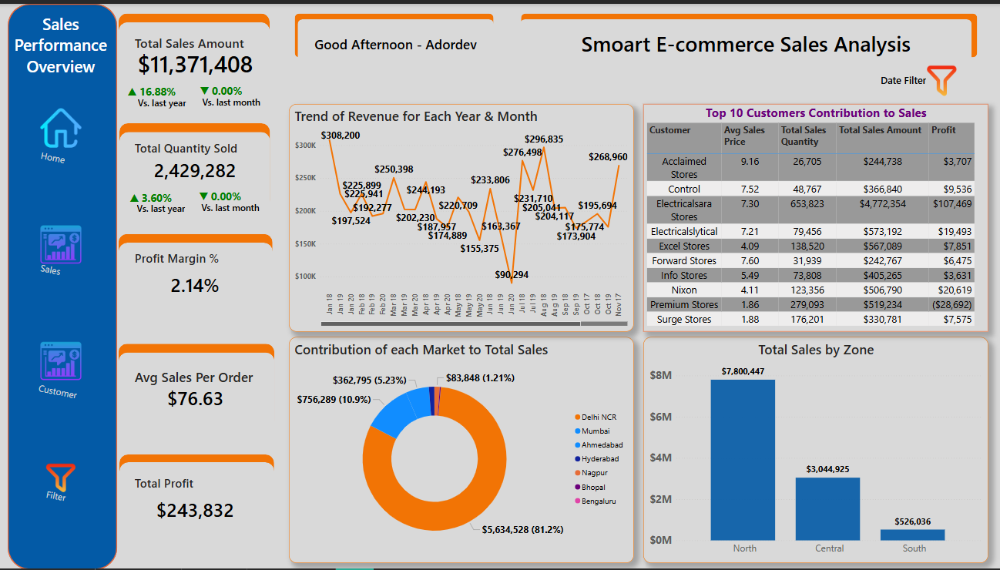
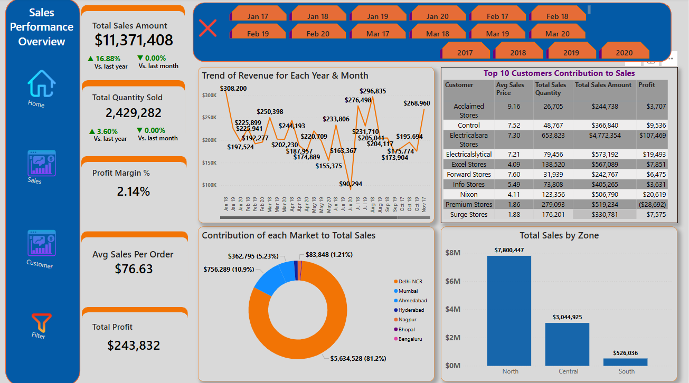
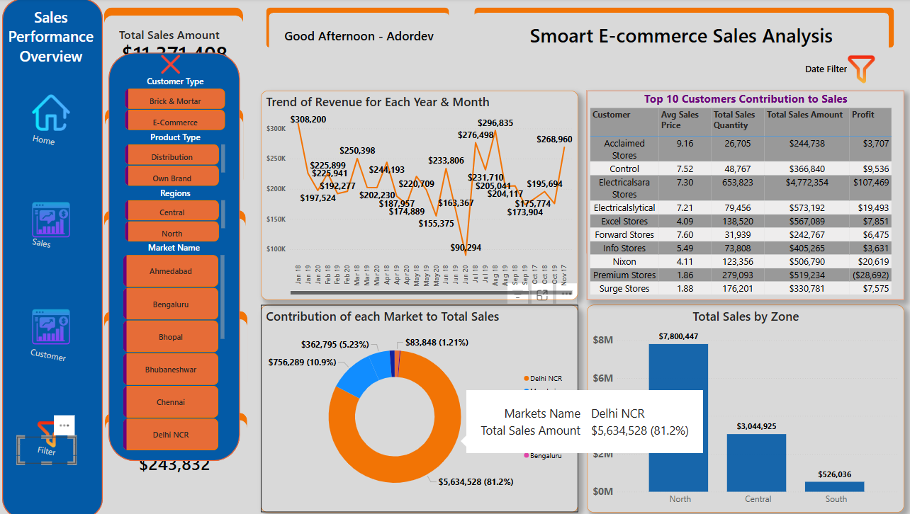
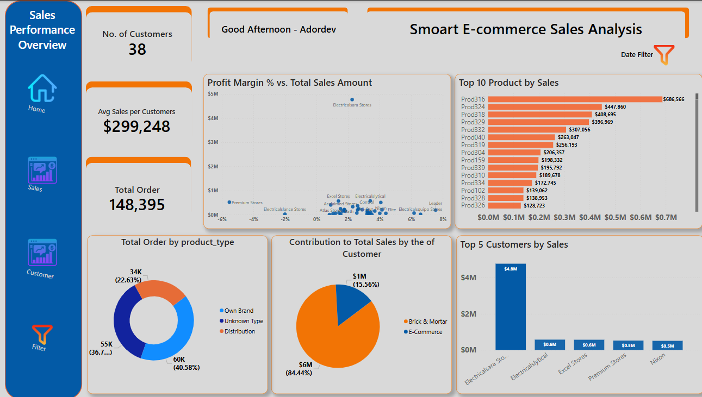

# Sales Insight & Performance Dashboard

[Click Here to Check it out on Power Bi Service]()
---

## 1. Title
**Sales Insight & Performance Dashboard**

---

## 2. Introduction
This project presents a comprehensive analysis of sales data collected from an MSSQL database. The dashboard highlights key business metrics such as total sales, profit margin, and customer contributions to overall performance. It is designed to provide actionable insights for stakeholders to make data-driven decisions.

---

## 3. About the Data
The dataset consists of raw transactional data retrieved from an MSSQL database. The data includes details such as customer information, sales amount, profit, product type, and transaction dates. The primary goal of this analysis is to clean, transform, and visualize the data to identify trends, opportunities, and customer behaviors.

---

## 4. Methodology

### **Data Collection**
Data was collected directly from an MSSQL database using SQL queries. The data retrieval involved multiple transactional tables containing customer, product, and sales-related information.

### **Data Cleaning & Transformation**
- **Tools Used**: Power BI and SQL.
- **Steps Taken**:
  - Merging multiple columns to create unified fields.
  - Updating column values for standardization.
  - Handling missing or inconsistent data.
  - Creating calculated columns for metrics such as Profit Margin and Avg Sales Per Order.
  

### **Exploratory Data Analysis (EDA)**
The cleaned data was analyzed to uncover patterns and relationships. Key metrics such as year-over-year (YOY) and month-over-month (MOM) growth, customer contributions, and product-level performance were explored.

### **Visualization**
- Dashboards were built in Power BI to present key metrics in an intuitive format.
- Used visual elements such as line charts, bar charts, and pie charts to highlight trends and distributions.

### **Statistical Analysis**
- Computed aggregated metrics (e.g., averages, totals).
- Identified trends in sales performance across time and customer segments.

### **Interpretation & Recommendations**
Insights derived from the analysis were interpreted to provide actionable recommendations for the business.

---

## 5. Data Structure Image

---

## 6. Data Model Overview
The Power BI data model was built with multiple connected tables:
- **Transactions Table**: Contains details of sales transactions.
- **Customers Table**: Stores customer-related information.
- **Products Table**: Includes product category, type, and pricing information.

---

## 7. Analysis
### Key Areas of Analysis:
1. Total sales and profit trends over time.
2. Customer segmentation by sales contribution.
3. Product performance metrics (top 10 products by sales).
4. Regional sales performance.
5. Analysis of repeat vs. new customers.

---

## 8. Dashboards
### **Sales Dashboard**

### **Customer Dashboard**

---

## 9. Insights
1. **Overall Sales Performance**:
   - Total Sales Amount: $11.37M.
   - YOY growth: 16.88%.
   - MOM growth: 0.00%.

2. **Top Performing Customers**:
   - Electricalsara Stores contributed 42% of total sales.
   - The top 5 customers account for over 60% of total revenue.

3. **Regional Sales Insights**:
   - Northern Zone generated $7.8M in sales, dominating overall performance.

4. **Product Trends**:
   - Prod316 is the top-performing product with $686K in sales.

5. **Customer Metrics**:
   - Average sales per customer: $299,248.
   - Total number of customers: 38.

---

## 10. Recommendations
1. **Focus on Top Customers**:
   - Develop loyalty programs for high-contributing customers such as Electricalsara Stores.
   
2. **Expand to High-Performing Regions**:
   - Invest in marketing and sales efforts in the Northern Zone to sustain and grow dominance.

3. **Optimize Underperforming Products**:
   - Evaluate products with lower sales contributions and strategize to improve performance.

4. **Improve Customer Acquisition**:
   - Target potential new customers through promotions and campaigns in underperforming zones.

5. **Seasonal Analysis**:
   - Further analyze sales trends to understand seasonal patterns and plan inventory accordingly.

